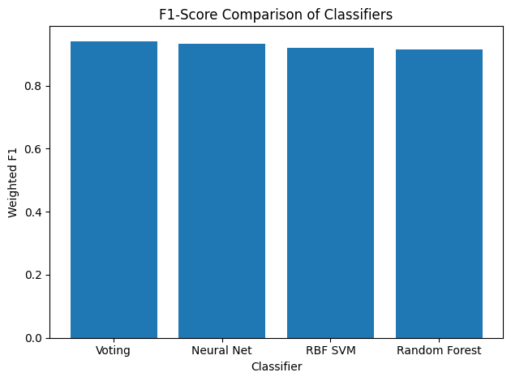
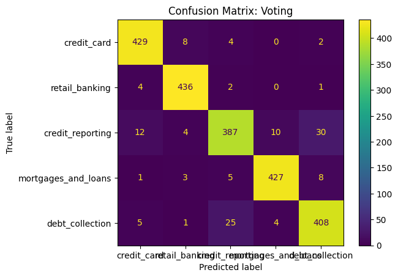

```markdown
# NLP Complaints Classification

This repository demonstrates how to classify **consumer complaints** into different **financial product categories** using **Natural Language Processing (NLP)** and various **Machine Learning** algorithms. The code leverages **Google’s Word2Vec** model for text embeddings, addresses class imbalance with **SMOTE**, and compares multiple classifiers. Finally, it presents performance metrics and visualizations (accuracy, F1-score, and a confusion matrix).

---

## Table of Contents

1. [Overview](#overview)  
2. [Dataset Details](#dataset-details)  
3. [Dependencies and Setup](#dependencies-and-setup)  
4. [Script Breakdown](#script-breakdown)  
5. [Usage](#usage)  
6. [Results](#results)  
7. [Project Structure](#project-structure)  
8. [Potential Improvements](#potential-improvements)  
9. [License](#license)

---

## Overview

Consumer complaints can provide critical insight into product and service issues. Accurately classifying these complaints into the correct financial product category (e.g., credit card, retail banking) helps in:

- Speeding up complaint resolution  
- Identifying trends or recurrent problems  
- Staying in compliance with regulatory requirements  

This project:

- Loads and cleans consumer complaint data (5,000 samples for demonstration).  
- Uses **Google News Word2Vec** (300-dimensional embeddings) to transform text into numerical vectors.  
- Addresses class imbalance using **SMOTE**.  
- Compares multiple classifiers:
  - **SVM** (RBF kernel)
  - **Random Forest**
  - **Neural Network (MLP)**
  - **Voting Ensemble** (soft voting combination of SVM, Random Forest, MLP)

It then displays classification metrics (Accuracy, F1-score) in bar charts and a **confusion matrix** for the top-performing model.

---

## Dataset Details

- **File**: `complaints_processed.csv`  
- **Columns**:
  - `product` (target category: `credit_card`, `retail_banking`, `credit_reporting`, `mortgages_and_loans`, `debt_collection`)  
  - `narrative` (the main complaint text)  
- **Data Cleaning**:
  - Duplicates and empty rows are removed.  
  - For demonstration, only the first 5,000 rows are used (you can adjust if needed).

---

## Dependencies and Setup

### 1. Python Version
- **Python 3.7+** recommended  

### 2. Install Required Libraries
```bash
pip install pandas numpy matplotlib gensim nltk scikit-learn imblearn
```

### 3. NLTK Stopwords
The script automatically attempts to download them if not found.  
If needed, you can also manually download them:
```python
import nltk
nltk.download('stopwords')
```

### 4. Google News Word2Vec
- The script uses `gensim.downloader` to load `word2vec-google-news-300`.  
- Ensure sufficient disk space (~1.6GB).

---

## Script Breakdown

### 1. Data Loading & Cleaning  
- Reads `complaints_processed.csv`.  
- Drops duplicates and empty or missing narratives.  
- Takes a 5,000-sample subset for faster demonstration.

### 2. Text Vectorization (Word2Vec)  
- Tokenizes each complaint (`RegexpTokenizer`).  
- Removes stopwords (`nltk.corpus.stopwords`).  
- Averages the Word2Vec embeddings to get a single 300-dimensional vector per complaint.

### 3. Handling Class Imbalance  
- Applies **SMOTE** to oversample minority classes.

### 4. Train-Test Split  
- Splits 80% for training, 20% for testing (stratified).

### 5. Model Training & Evaluation  
- **SVM** (RBF), **Random Forest**, **Neural Net (MLP)**, **Voting** (soft).  
- Scores each with **accuracy** and **weighted F1**.

### 6. Visualization  
- **Accuracy** comparison (saved as `graph1.png`).  
- **F1-score** comparison (saved as `graph2.png`).  
- **Confusion Matrix** for the best classifier (saved as `graph3.png`).

---

## Usage

### 1. Acquire the Dataset  
Ensure `complaints_processed.csv` is in the same directory as the script (or update the path in the code).

### 2. Run the Script  
```bash
python nlp_complaints_classification.py
```
The script:
- Checks for and downloads any missing stopwords.  
- Fetches the Word2Vec model if needed.  
- Processes the text, trains the models, and prints performance results.

### 3. Check Outputs  
- **Terminal Output** with each model’s final metrics.  
- **Bar Charts**:
  - Accuracy comparison: `graph1.png`
  - F1-score comparison: `graph2.png`
- **Confusion Matrix** (best classifier): `graph3.png`

---

## Results

When running on our 5,000-row subset, we obtained:

```
RBF SVM:       accuracy=0.9215, f1=0.9213
Random Forest: accuracy=0.9156, f1=0.9153
Neural Net:    accuracy=0.9332, f1=0.9328
Voting:        accuracy=0.9418, f1=0.9415
```

- **Best Classifier**: **Voting** ensemble (accuracy=0.9418, F1=0.9415)

### Accuracy Comparison


### F1-Score Comparison


### Confusion Matrix of Best Classifier


---

## Project Structure

```
.
├── nlp_complaints_classification.py
├── complaints_processed.csv
├── graph1.png
├── graph2.png
├── graph3.png
└── README.md
```

- `nlp_complaints_classification.py`: Main script to run the pipeline.  
- `complaints_processed.csv`: Data file.  
- `graph1.png`, `graph2.png`, `graph3.png`: Generated bar charts & confusion matrix.  
- `README.md`: This documentation file.

---

## Potential Improvements

1. **Hyperparameter Tuning**  
   - Use `GridSearchCV` or `RandomizedSearchCV` on each classifier to find optimal settings.

2. **Alternate Embeddings**  
   - Consider BERT/RoBERTa for potentially better semantic representation.

3. **Feature Engineering**  
   - Experiment with additional features (e.g., sentiment scores).

4. **Full Dataset**  
   - Instead of a 5,000-row subset, try the entire dataset (if computational resources allow).

---
